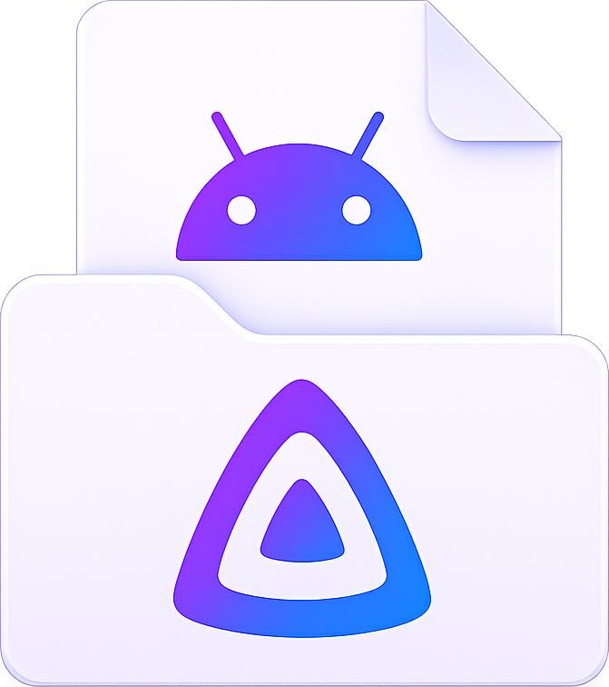

<h1>
   Jellyfin Documents Provider
</h1>

  
  

Map [Jellyfin](https://jellyfin.org) to an Android `DocumentsProvider` so any file manager or music player (e.g. [Poweramp](https://powerampapp.com)) can browse and stream your Jellyfin media library.

## Usage

1. Install and open the app
2. Tap **+** to add a server, enter your Jellyfin URL, username and password
3. Tap **Test Server** to authenticate, then select which media libraries to sync
4. After sync completes, open any app that supports `DocumentsProvider` (file manager, music player)
5. Navigate to the **JellyfinDocumentsProvider** root — your Jellyfin media appears as a virtual filesystem

The app syncs library metadata (albums, tracks, artwork) to a local database. When you open a file, audio streams directly from your Jellyfin server.

## Features

- [x] **DocumentsProvider** — browse Jellyfin media as a virtual filesystem in any file manager or music player
- [x] **Multi-server** — add multiple Jellyfin servers, each as a separate filesystem root
- [x] **Audio streaming** — stream music directly from Jellyfin with bitrate limiting
- [x] **File caching** — progressive download caching for smooth playback and seeking
- [x] **Album art / thumbnails** — lazy on-demand fetch with deduplication
- [x] **Cache management** — view stats, per-item swipe-to-delete, and bulk cleanup
- [x] **Database sync** — foreground sync with progress notification, batch fetching, album grouping, and favorites-only mode
- [x] **Poweramp integration** — track provider, playback scrobbling, post-sync auto-rescan, and lyrics delivery
- [x] **Bidirectional rating sync** — sync Jellyfin favorites ↔ Poweramp ratings, with configurable direction toggles
- [x] **Lyrics support** — fetch Jellyfin server-side lyrics, convert to LRC, and deliver to Poweramp
- [x] **Quick Connect login** — log in with a Jellyfin Quick Connect code
- [x] **Secure token storage** — AES256-GCM encrypted tokens
- [x] **In-app log viewer** — real-time log with level filtering and auto-scroll
- [x] **Status monitoring** — in-app chips showing active sync, metadata, and network operations
- [x] **Wave generation** — Poweramp waveform display for audio tracks
- [x] **Server wizard** — step-by-step add-server flow with library selection
- [x] **In-app settings** — toggle Poweramp scan-on-sync, like-sync direction, and log level filter
- [ ] 401 / token expiry re-login
- [ ] User-facing notifications (sync complete, errors)
- [ ] Better UI polish

